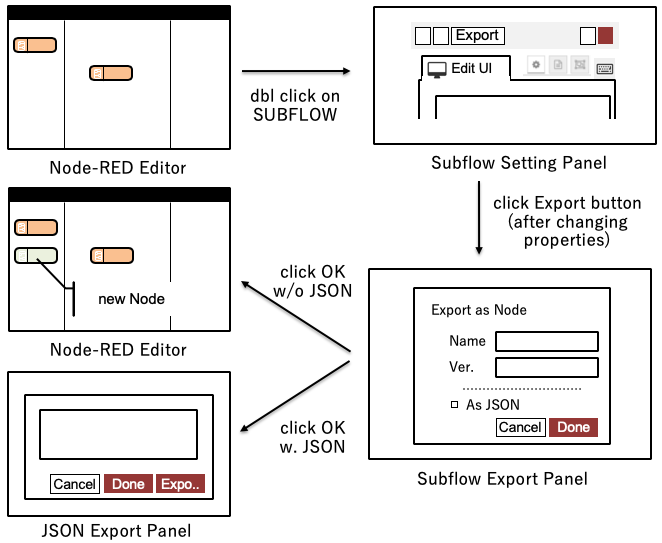
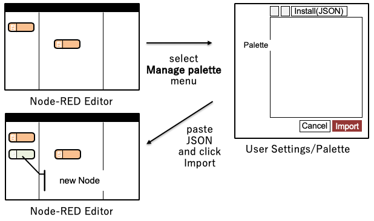

# Exportable Subflow

This proposal covers how a Subflow can be exported from the editor for reuse elsewhere.

They key requirement is that once it is imported, the end user is not aware the node
was implemented as a subflow - it appears as a regular node in their palette and
they cannot edit the internals.

This design will cover how this could be handled in the editor UI.

The mechanism for packaging a subflow as a redistributable node module will be
covered by [Subflow Node Modules](../subflow-node-modules.md).

This feature *must* also consider the wider enhancements to the Library UX that
are in the roadmap. (*TODO: add a link to the design doc once added*).

### Authors

 - @HiroyasuNishiyama

### Details

#### Exporting Subflow as Node

Node can be exported as JSON code or converted to a Node.

By clicking **Export** button on Subflow Setting Panel of Subflow template, Subflow Export Panel is shown.

In this panel, new node information such as node name, version, etc. can be specified. There is **As JSON** check box on this panel.  If this is checked, JSON export panel is shown.  Otherwise, new node is installed on  editor palette.  

New node created from SUBFLOW is sealed.  Thus, its internal flow or UI definition can not be edited.

#### Importing SUBFLOW Node

Node represented as JSON data can be imported in Node-RED environment from palette management UI.

There is **Install(JSON)** button on top of the panel.  After importing JSON, new node is installed on editor palette.

## History

  - 2019-02-27 - migrated from Design note wiki
