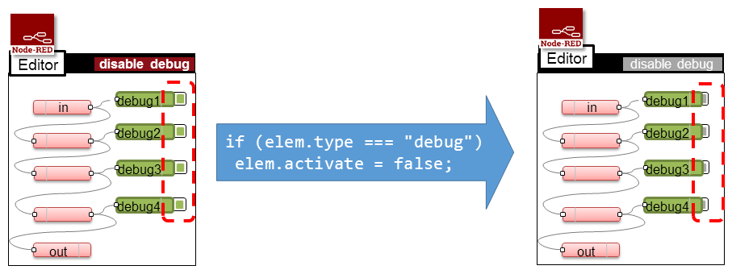
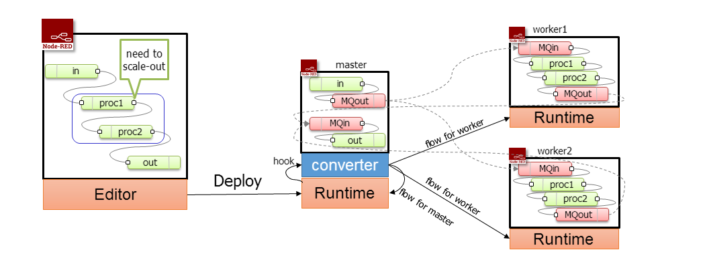
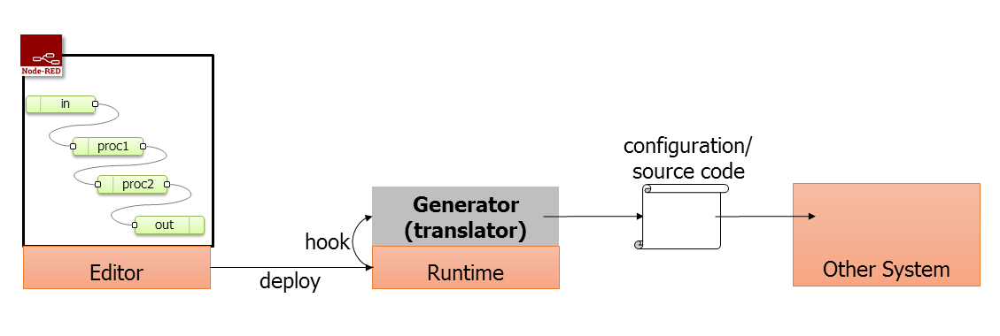
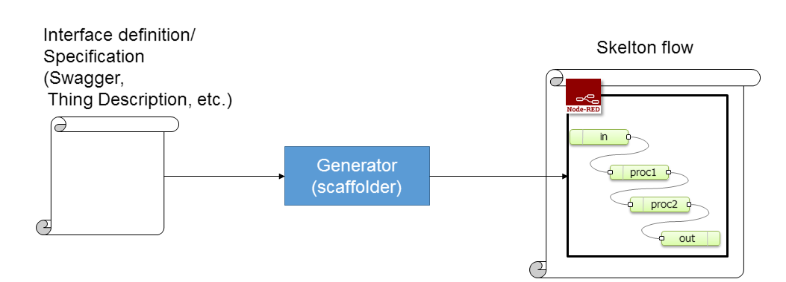
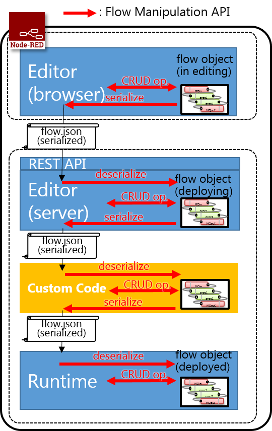
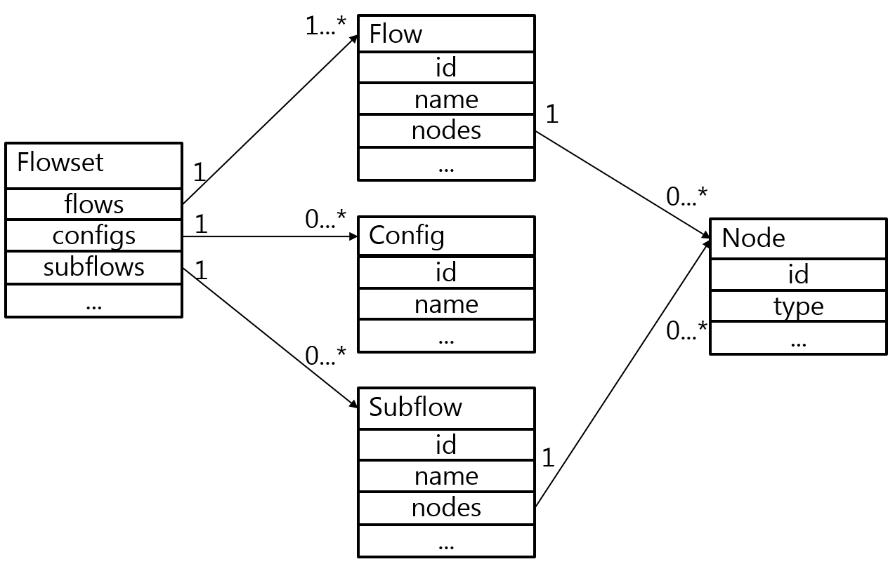

# Flow Manipulation API

**State:** in-progress

## Summary

Purpose of Flow Manipulation API is to extend functionality of Node-RED flow
editor / runtime via unified interface for translating or modifying a flow definition.

## Authors

 - @k-toumura

## Details

### Use Cases and Requirement

#### Inactivate all debug node in one click

##### Case description
In a flow development, a developer frequently uses debug nodes to check
messages emitted from nodes.
When development is finished, we have to disable or eliminate debug output.
However, it take time to effort to do it by hand.

##### Requirements
- In Editor:
  - Interface for search nodes that satisfy some condition.
  - Interface for retrieving node's properties and modifying it.
  - Interface for adding button or menu item to execute bulk operation.

#### Deploy to multiple Node-RED runtime

##### Case description
To increase capacity of flow processing, we could use multiple runtime for
single flow execution.  When a flow is deployed from editor,
deployment handler modifies the flow and distribute it appropriately
among runtimes.

##### Requirements
- In Runtime:
  - Interface for insert a hook in deployment handler to call additional function.
  - Interface for create new flow instance for distribution.
  - Interface for insert new nodes to the flow for communicate between runtimes.

#### Use Editor in Other Systems

##### Case description

Node-RED's flow editing facility makes programming easier.
If we can use Node-RED editor to write a program runs on another platform,
we could increase productivity.

##### Requirements
- In Editor or runtime
  - Interface for CRUD operation for flow and contained nodes to create an abstruct syntax tree from flow definition.
  - Transpile a flow definition to another configuration file or a program written in another language.

#### Generate flow from Other Configration/Definition Language

##### Case description
For integrate IoT things to Node-RED, we can use interface description Languages to
automatically generate stub to interact things.
For example, W3C Web of Things uses "Thing Description", and OCF uses "Swagger/OpenAPI"
for describe interface of Things.

##### Requirements
- In external systems
  - create Node-RED flow definition object in a program.
  - write out flow.json file that contains skelton flows for interact with things.

### API Overview

Flow Manipulation API is used in Editor, Runtime, and custom code module between Editor and Runtime.  A custom code module is used to modify flow definition, distribute multiple runtime, convert flow definition to configuration file of other execution environment, and so on.
The API can be used in stand-alone CLI application (4th use case).

- JavaScript API for browser-side
  - Create/Read/Update/Delete nodes/flows in editor
  - Serialize flow object
- Javascript API for server-side, stand-alone CLI application
  - Serialize/deserialize flow object
  - Create/Read/Update/Delete nodes/flows
  - Export/Import a flow in well-defined format

In first phase, server-side module will be provided and will mainly used in custom code modules.
Similar Flow Manipulation API in browser-side is future work due to its complexity.

#### Flow Model

Based on [Design: Flow file format v2](https://github.com/node-red/node-red/wiki/Design%3A-Flow-file-format-v2).

#### Operations

##### FlowSet Class
- constructor()
  - create empty flowset
- static copyFlow(flowset, flowId)
  - create flowset from a flow of other FlowSet
- static parseFlow(string or array)
  - create Flowset from flow.json string or parsed array
  - returns: FlowSet object
- generator()
  - iterate over all nodes in this flowset.
- getNode(nodeId)
  - retrieve a node in this FlowSet by its node Id
  - returns: Node object
- getFlow/Config/Subflow(nodeId)
  - retrieve a flow/config/subflow in this FlowSet by its node Id
  - returns: Flow/Config/Subflow object
- prev(nodeId)
  - retrieve nodes which output port is connected to the node.
  - returns: Array of Node objects.
- next(nodeId)
  - retrieve nodes which the node's output port is connected to.
  - returns: Array of Node objects.
- insert(nodeId, port, prevNodeId, prevNodePort, nextNode)
  - insert the node between prevNode and nextNode
  - port is output port number of inserting node
  - prevNodePort id output port number of node in front of inserting node
  - if there is a link from prev node to nextNode, the link is unconnected.
  - returns: none.
- remove(nodeId)
  - remove the node from Nodeset
  - returns: removed node object.
- serialize(format-string)
  - seriazlize FlowSet to designated format
  - format-string: "JSON-1", "JSON-2", "YAML-1", etc.
  - returns: serialized flowset
- connected(nodeId)
  - get connected nodes of the designated node.
  - returns: array of nodeIds
- diff(flowset)
  - analyse difference of two flow set
  - returns: node ids of added, deleted, changed nodes

##### Flow Class
- constructor(nodeid, name)
  - create empty flow.
- generator()
  - iterate over nodes in this flow
- addNode(node)
  - add Node to this Flow
- getNode(nodeId)
  - retrieve a node by its id
- prev(nodeId)
  - retrieve nodes which output port is connected to the node.
  - returns: Array of Node objects.
- next(nodeId)
  - retrieve nodes which the node's output port is connected to.
  - returns: Array of Node objects.
- insert(nodeId, port, prevNodeId, prevNodePort, nextNode)
  - insert the node between prevNode and nextNode
  - port is output port number of inserting node
  - prevNodePort id output port number of node in front of inserting node
  - if there is a link from prev node to nextNode, the link is unconnected.
  - returns: none.
- remove(nodeId)
  - remove the node from Nodeset
  - returns: removed node object.
- diff(flow)
  - analyse difference of two flows
  - returns: node ids of added, deleted, changed nodes

##### Subflow Class
- constructor(nodeid, name)
  - create empty subflow.
- generator()
  - iterate over nodes in this subflow
- addNode(node)
  - add Node to this Flow
- getNode(nodeId)
  - retrieve a node by its id
- prev(nodeId)
  - retrieve nodes which output port is connected to the node.
  - returns: Array of Node objects.
- next(nodeId)
  - retrieve nodes which the node's output port is connected to.
  - returns: Array of Node objects.
- setInOutNode(numIn, numOut)
  - create input/output ports as special node.
- insert(nodeId, port, prevNodeId, prevNodePort, nextNode)
  - insert the node between prevNode and nextNode
  - port is output port number of inserting node
  - prevNodePort id output port number of node in front of inserting node
  - if there is a link from prev node to nextNode, the link is unconnected.
  - returns: none.
- remove(nodeId)
  - remove the node from Nodeset
  - returns: removed node object.
- diff(flow)
  - analyse difference of two flows
  - returns: node ids of added, deleted, changed nodes

##### Node Class
- constructor(nodeid)
  - create empty node.
- connectTo(fromport, nextNodeId)
  - connect the node to designated node.
- unconnectTo(fromport, nextNodeId)
  - unconnect the node from designated node.

##### Config Class
- constructor(nodeid, name)
  - create empty config node.

### Related works

- [Design: Flow file format v2](https://github.com/node-red/node-red/wiki/Design%3A-Flow-file-format-v2)

- [Design: Runtime Editor Split](https://github.com/node-red/node-red/wiki/Design%3A-Runtime-Editor-Split)

## History

 - 2019-02-27 - migrated from Design note wiki
